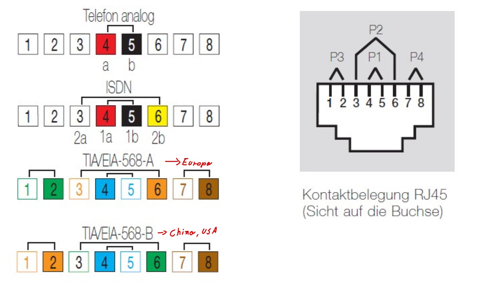
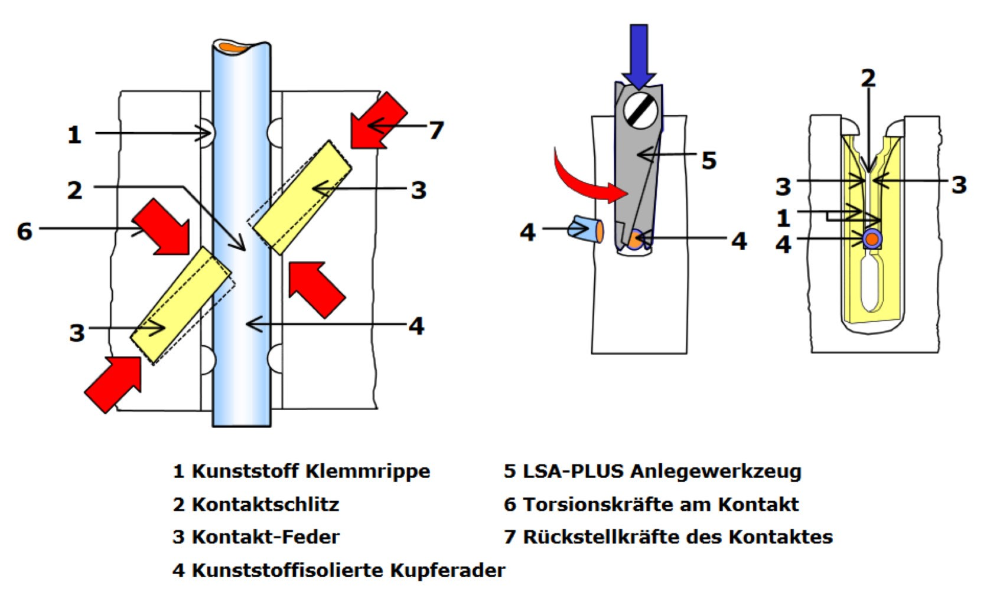
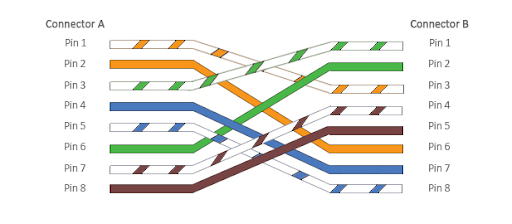
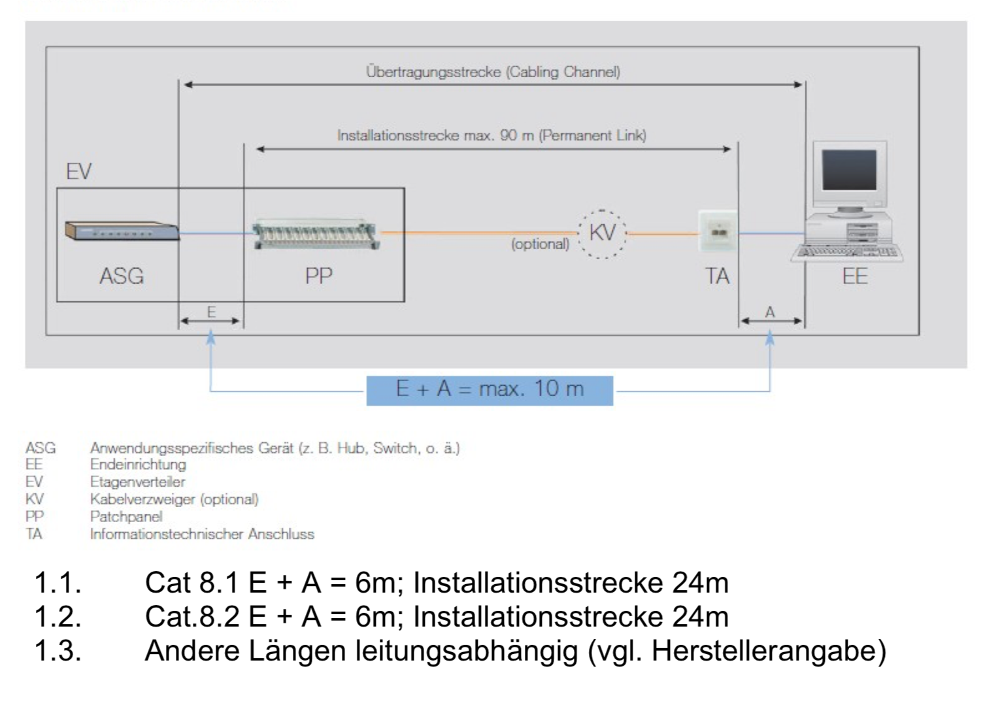

# lABOR KA 1
Hi, ich habe probiert alles Klassenarbeit relevante zusammen zu schreiben :)
## Kategorien und Klassen
| EIA/TIA 568 | ISO/IEC 11801 | EN 50173 | max. Frequenz | Impedanz | Anwendung |
| ----------- | ------------- | -------- | ------------- | -------- | --------- |
| Cat. 5e     | Cat. 5e       | Class D  | 100 MHz       | 100 Ohm  | 1 GBase-T |
| Cat. 6A     | Cat. 6a       | Class EA | 500 MHz       | 100 Ohm  | 10 GBase-T|
|             | Cat 7. A      | Class FA | 1.000 MHz     | 100 Ohm  | 10 GBase-T|
**1 GBase-T** == **1Gbit**, das Gelbe Kabel welches wir benutzt haben, was das
Cat. 7A

## EIA/TIA-Norm

## AUfbau der LEitungen -CAT-KAbel (Twisted Pair)
- Kupferkabel mit gekreutzten, verdrillten bzw. verseilten Adernpaaren
- Es gibt die KAtegorien 1 bis 7
- Bezeichnungssystem nach **ISO/IEC-11801(2002)E**: XX/YZZ

| Gruppe/Buchstabe                  | Beschreibung               |
| --------------------------------- | -------------------------- |
| XX steht für die Gesamtschirmung: |                            |                                   
| U                                 | Ohne Schirm (Ungeschirmt)  |
| F                                 | Folienschirm               |
| S                                 | Geflechtschirm             |
| SF                                | Geflecht- und Folienschirm |
| Y steht für die Aderschirmung:    |                            |
| U                                 | Ohne Schirm (Ungeschirmt)  |
| F                                 | Folienschirm               |
| S                                 | Geflchetschirm             |
| ZZ steht **immer** für:           |                            |
| TP                                | Twisted Pair               |
in unserem Projekt wurde ein S/FTP-Kabel verwendet. In der Klassenarbeit
kann zum Beispiel folgendes kommen: Zeichne eine Leitung die so beschriftet ist: SF/UTP

## LSA-LSA Anschlusstechnik

LSA steht für Lötfrei, Schraubfrei und Abisolierfrei! \
Alte Anschlüsse mussten abisoliert werden, weil alte Verbindungen mit Schrauben gemacht wurden.
Durch den Aufbau des LSA-Anschlusses können Kabel direkt hineingedrückt werden. Daruch
werden Zeit und Resourcen gespart

## Patchkabel / Crossoverkabel

## Permanent Link - Channel Link

