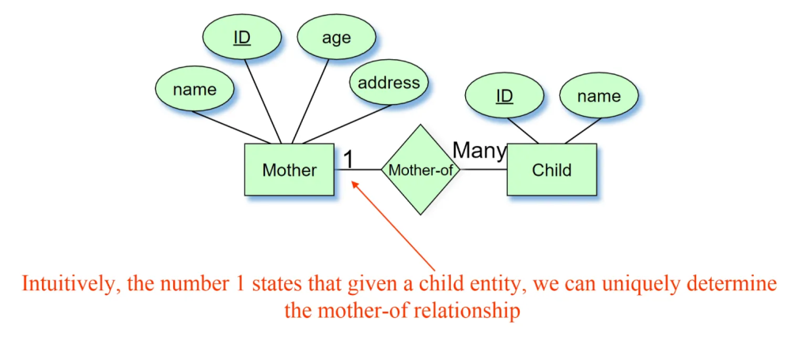
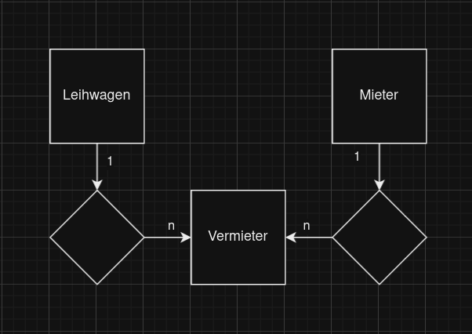

Übung:



Gib 

 das Relationenschema aller Tabellen an:

Mother(id, name, age, address)

Child(id, name, **mother_id**)

Der Fremdschlüssel verbirgt sich implizit in der Grafik und muss ins Relationenschema!CSV


```csv
id,name,adresse,bestellnummer
1,Max Mustermann,Musterstraße 1,12345
2,Maria Musterfrau,Beispielweg 5,67890
3,John Doe,Doe Street 10,54321
```

JSON

```json
[
    {
        "id": 1,
        "name": "Max Mustermann",
        "adresse": "Musterstraße 1",
        "bestellnummer": 12345
    },
    {
        "id": 2,
        "name": "Maria Musterfrau",
        "adresse": "Beispielweg 5",
        "bestellnummer": 67890
    },
    {
        "id": 3,
        "name": "John Doe",
        "adresse": "Doe Street 10",
        "bestellnummer": 54321
    }
]
```

XML

```xml
<kunden>
    <kunde>
        <id>1</id>
        <name>Max Mustermann</name>
        <adresse>Musterstraße 1</adresse>
        <bestellnummer>12345</bestellnummer>
    </kunde>
    <kunde>
        <id>2</id>
        <name>Maria Musterfrau</name>
        <adresse>Beispielweg 5</adresse>
        <bestellnummer>67890</bestellnummer>
    </kunde>
    <kunde>
        <id>3</id>
        <name>John Doe</name>
        <adresse>Doe Street 10</adresse>
        <bestellnummer>54321</bestellnummer>
    </kunde>
</kunden>
```
